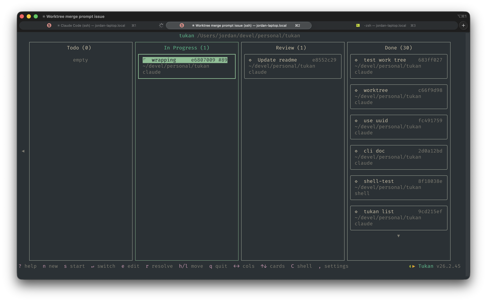

# Tukan



A kanban-style task manager that lives inside tmux. Organize your work as cards on a board, launch tmux windows from them, and let Tukan automatically track what you're working on.

## Core Principles

### Activity-driven card movement

Tukan watches your tmux panes for output changes every few seconds. When a card in **In Progress** goes idle for 30 seconds, it's automatically promoted to **Review**. When activity resumes in a Review card's window, it's demoted back to **In Progress**. You never have to manually shuffle cards between these columns — the board reflects what you're actually doing.

```
Todo ──[start]──▸ In Progress ──[30s idle]──▸ Review
                       ▴                        │
                       └────[activity detected]──┘
```

### Pipeline of tasks

The board is a pipeline: **Todo → In Progress → Review → Done**. Cards flow left to right as work progresses. You focus on creating cards and starting work — Tukan handles the middle of the pipeline by detecting which tasks are active. Resolve cards to Done when you're finished.

## Install

Requires [Node.js](https://nodejs.org/) (v18+) and [tmux](https://github.com/tmux/tmux).

```sh
npm install -g tukan
```

Then run inside any tmux session:

```sh
tukan
```

Tukan auto-detects your tmux server. It stores state in `~/.config/tukan/state.json`.

## Developer Setup

```sh
git clone https://github.com/jordanpwalsh/tukan.git
cd tukan
npm install
```

**Run from source:**

```sh
npx tsx src/index.tsx
```

**Run tests:**

```sh
npx vitest        # watch mode
npx vitest run    # single run
```

**Build:**

```sh
npm run build
```

This compiles TypeScript to `dist/` and patches the version.

## Usage

### TUI (default)

Launch the board UI inside tmux:

```sh
tukan
```

### CLI subcommands

Manage cards without entering the TUI:

```sh
tukan add "Fix login bug"       # create a card in Todo
tukan start <card>              # start a card (creates tmux window)
tukan resolve <card>            # move card to Done
tukan peek <card>               # show a card's current pane content
tukan send <card> <text>        # send keystrokes to a card's pane
tukan list                      # list cards
tukan sessions                  # list tukan sessions
tukan refresh                   # sync activity state
```

### Keybindings

| Key | Action |
|-----|--------|
| `←` `→` | Navigate columns |
| `↑` `↓` | Navigate cards |
| `h` / `l` | Move card between columns |
| `s` | Start/restart card |
| `Enter` | Switch to window / confirm start |
| `n` | New card |
| `e` | Edit card |
| `r` | Resolve (move to Done) |
| `q` | Quit |

### Pane interaction

Read or respond to a card's pane content from the CLI — useful for seeing what a process is waiting for (like a Claude Code permission prompt) or for AI agents:

```sh
tukan peek <card>               # print the full pane content
tukan peek <card> -n 5          # last 5 non-blank lines only
tukan send <card> y             # send "y" + Enter to the card's pane
tukan send <card> --no-enter n  # send "n" without pressing Enter
```

### Card indicators

| Symbol | Meaning |
|--------|---------|
| *(blank)* | Unstarted card (no window) |
| `○` | Has tmux window, idle |
| `●` | Active window |
| `◆` | Recent activity (green) |
| `◇` | Closed (was started, window gone) |

## Architecture

- **Functional core, imperative shell** — pure board logic is separated from IO (tmux IPC, rendering, persistence)
- **Ink** (React for CLIs) powers the TUI
- **tmux CLI** for all window/session management — no tmux plugins required

## License

ISC